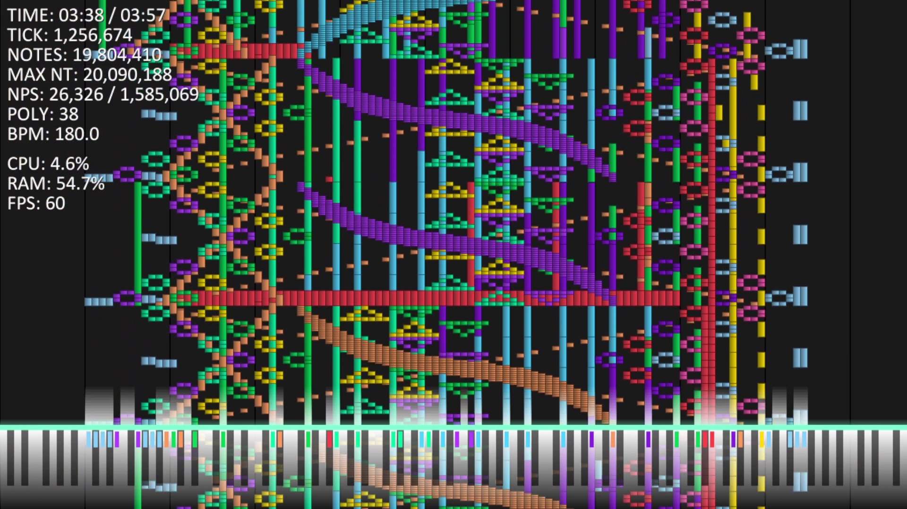

# Rain MIDI
[日本語](README.ja.md) | [English](README.md)

### **Rain MIDI** is Lightweight Black MIDI Renderer.

## 📜 Copyright
Copyright (c) 2025, Suka  
All rights reserved.

- [YouTube](https://youtube.com/@sukao_o567?si=EvGffBqJNjGzoMVd)
- [X (Twitter)](https://x.com/Suka_XxO_OxX)
- [GitHub](https://github.com/Suka-T)

## 🪪 License
This software is released under the [MIT License](LICENSE).

You may use this software under the following conditions:

1. This software is free software.
You may use it freely for personal or commercial purposes.

2. If you redistribute or copy this software,
you must include the above copyright notice
and the accompanying documentation.

3. The author is not responsible for any damage
caused by the software, including malfunction
or environment issues.

## ☕ About Zulu JDK/JRE
This application includes **Zulu OpenJDK** provided by **Azul Systems, Inc.**

Zulu OpenJDK is licensed under the **GNU General Public License version 2 (GPLv2)** with the **Classpath Exception**.

- [OpenJDK Project](https://openjdk.java.net/)
- [GPLv2 + Classpath Exception](https://openjdk.java.net/legal/gplv2+ce.html)
- [Azul Systems](https://www.azul.com/)

The source code of Zulu JDK/JRE included in this application
can be obtained by requesting it from Azul
(available within 3 years from receipt, actual cost only).

For details, contact azul_openjdk@azul.com.

JDK/JRE version used:
Zulu 21.42+19 (c2f88d00-0d1c-448f-8f72-27f1326b7e18)